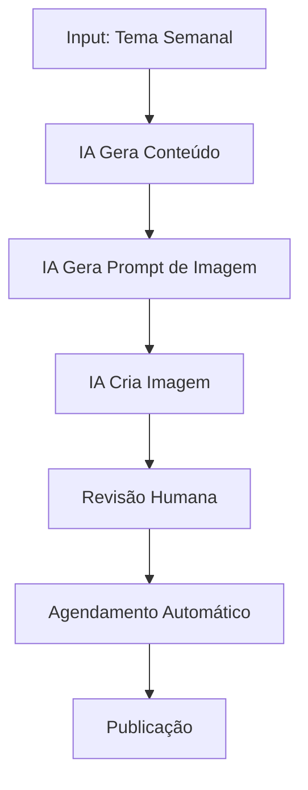

# Pipeline de Geração de Conteúdo com IA - "O Mundo Precisa de um Pai"

## 🤖 Visão Geral do Pipeline

### Objetivos do Pipeline de IA
- **Automatizar** a criação de conteúdo base
- **Otimizar** o tempo da equipe
- **Manter** consistência na qualidade
- **Escalar** a produção de conteúdo
- **Personalizar** conteúdo por plataforma

## 🛠️ Ferramentas de IA Recomendadas

### Para Texto
- **ChatGPT (GPT-4)**: Geração de posts, roteiros, descrições
- **Claude (Anthropic)**: Análise de conteúdo, revisão
- **Copy.ai**: Copywriting otimizado
- **Jasper**: Templates de marketing

### Para Imagens
- **Midjourney**: Imagens artísticas e conceituais
- **DALL-E 3**: Ilustrações e designs
- **Canva AI**: Templates e designs
- **Stable Diffusion**: Imagens personalizadas

### Para Vídeo
- **Runway ML**: Edição de vídeo com IA
- **Synthesia**: Vídeos com avatares
- **Lumen5**: Vídeos a partir de texto
- **Pictory**: Resumos de vídeo

### Para Áudio
- **ElevenLabs**: Vozes sintéticas
- **Murf.ai**: Narração automática
- **Descript**: Edição de áudio

## 📋 Processo de Implementação

### Etapa 1: Configuração Inicial (Semana 1)

#### 1.1 Setup das Ferramentas
```bash
# Exemplo de configuração de API
export OPENAI_API_KEY="sua_chave_aqui"
export ANTHROPIC_API_KEY="sua_chave_aqui"
export MIDJOURNEY_API_KEY="sua_chave_aqui"
```

#### 1.2 Criação de Prompts Base
```markdown
# Prompt Template para Posts do Instagram
Tema: [TEMA_DO_POST]
Tom: [INSPIRADOR/EDUCATIVO/EMOCIONANTE]
Público: [PAIS/MÃES/INTERESSADOS]
Call-to-action: [AÇÃO_ESPECÍFICA]
```

#### 1.3 Definição de Personas
- **Pai Primário**: 30-45 anos, filhos pequenos
- **Mãe Interessada**: 25-40 anos, busca apoio
- **Especialista**: Psicólogos, educadores
- **Influenciador**: Pais com seguidores

### Etapa 2: Desenvolvimento de Templates (Semana 2)

#### 2.1 Templates de Conteúdo por Plataforma

**Instagram Post Template:**
```
🎯 [TÍTULO ATRAENTE]

📝 [CONTEÚDO PRINCIPAL - 2-3 PARÁGRAFOS]

💡 [DICA PRÁTICA]

❤️ [CALL-TO-ACTION EMOCIONAL]

#OMundoPrecisaDeUmPai #PaternidadeConsciente #[HASHTAG_RELEVANTE]
```

**Facebook Article Template:**
```
# [TÍTULO COMPLETO]

## Introdução
[CONTEXTO E PROBLEMA]

## Desenvolvimento
[3-4 SEÇÕES COM CONTEÚDO]

## Conclusão
[RESUMO E PRÓXIMOS PASSOS]

---
*Compartilhe sua experiência nos comentários!*
```

#### 2.2 Prompts Especializados

**Prompt para Geração de Dicas Práticas:**
```
Como pai/mãe especialista em paternidade consciente, crie 5 dicas práticas sobre [TEMA]. 
Cada dica deve ser:
- Acionável e específica
- Baseada em evidências científicas
- Adaptável para diferentes realidades
- Motivacional e positiva
```

**Prompt para Storytelling:**
```
Crie uma história emocionante sobre [SITUAÇÃO] que:
- Conecte com pais e mães
- Tenha início, meio e fim claros
- Inclua uma lição ou reflexão
- Seja autêntica e realista
- Termine com esperança
```

### Etapa 3: Automação do Pipeline (Semana 3-4)

#### 3.1 Script de Automação (Python)

```python
# content_generator.py
import openai
import json
from datetime import datetime, timedelta

class ContentGenerator:
    def __init__(self, api_key):
        self.client = openai.OpenAI(api_key=api_key)
        
    def generate_weekly_content(self, theme, platform):
        """Gera conteúdo semanal para uma plataforma específica"""
        
        prompt = f"""
        Como especialista em paternidade consciente, crie conteúdo para {platform} sobre {theme}.
        
        Requisitos:
        - Tom inspirador e educativo
        - Linguagem acessível
        - Call-to-action claro
        - Hashtags relevantes
        - Adaptado para {platform}
        
        Retorne em formato JSON com:
        - título
        - conteúdo
        - hashtags
        - call_to_action
        """
        
        response = self.client.chat.completions.create(
            model="gpt-4",
            messages=[{"role": "user", "content": prompt}],
            temperature=0.7
        )
        
        return json.loads(response.choices[0].message.content)
    
    def generate_image_prompt(self, content):
        """Gera prompt para criação de imagem"""
        
        prompt = f"""
        Crie um prompt para Midjourney baseado neste conteúdo sobre paternidade:
        {content}
        
        O prompt deve gerar uma imagem:
        - Calorosa e acolhedora
        - Representando família
        - Com cores azul, verde e laranja
        - Estilo fotográfico realista
        """
        
        response = self.client.chat.completions.create(
            model="gpt-4",
            messages=[{"role": "user", "content": prompt}],
            temperature=0.8
        )
        
        return response.choices[0].message.content

# Uso
generator = ContentGenerator("sua_api_key")
content = generator.generate_weekly_content("paternidade ativa", "instagram")
```

#### 3.2 Workflow de Automação



### Etapa 4: Otimização e Personalização (Semana 5-6)

#### 4.1 Análise de Performance

```python
# performance_analyzer.py
import pandas as pd
from datetime import datetime

class PerformanceAnalyzer:
    def __init__(self):
        self.metrics = []
    
    def track_performance(self, post_data):
        """Rastreia performance de posts"""
        metrics = {
            'date': datetime.now(),
            'platform': post_data['platform'],
            'theme': post_data['theme'],
            'engagement_rate': post_data['engagement'],
            'reach': post_data['reach'],
            'ai_generated': post_data['ai_generated']
        }
        self.metrics.append(metrics)
    
    def optimize_prompts(self):
        """Otimiza prompts baseado em performance"""
        df = pd.DataFrame(self.metrics)
        
        # Análise de quais temas performam melhor
        best_themes = df.groupby('theme')['engagement_rate'].mean().sort_values(ascending=False)
        
        # Análise de performance de conteúdo IA vs manual
        ai_vs_manual = df.groupby('ai_generated')['engagement_rate'].mean()
        
        return {
            'best_themes': best_themes.head(5).to_dict(),
            'ai_performance': ai_vs_manual.to_dict()
        }
```

#### 4.2 Personalização por Plataforma

**Instagram Optimization:**
```python
def optimize_for_instagram(content):
    """Otimiza conteúdo para Instagram"""
    optimized = {
        'max_length': 2200,
        'hashtags': 20,
        'emojis': True,
        'call_to_action': 'story_mention',
        'format': 'carousel_friendly'
    }
    return apply_optimization(content, optimized)
```

## 📊 Métricas de Sucesso do Pipeline

### Métricas Quantitativas
- **Eficiência**: 70% redução no tempo de criação
- **Qualidade**: Taxa de aprovação > 90%
- **Engajamento**: Manter ou aumentar engajamento atual
- **Escalabilidade**: 5x mais conteúdo com mesma equipe

### Métricas Qualitativas
- Feedback positivo da comunidade
- Consistência na voz da marca
- Relevância do conteúdo
- Autenticidade mantida

## 🔄 Workflow Semanal

### Segunda-feira: Planejamento
1. **Análise de Tendências** (IA)
2. **Definição de Temas** (Humano + IA)
3. **Geração de Briefings** (IA)

### Terça a Quinta: Criação
1. **Geração de Conteúdo Base** (IA)
2. **Criação de Imagens** (IA)
3. **Revisão e Ajustes** (Humano)
4. **Otimização por Plataforma** (IA)

### Sexta: Finalização
1. **Agendamento Automático** (IA)
2. **Preparação de Stories** (IA)
3. **Monitoramento Setup** (IA)

### Fim de Semana: Monitoramento
1. **Análise de Performance** (IA)
2. **Ajustes de Prompts** (Humano)
3. **Planejamento da Próxima Semana** (IA)

## 🚀 Próximos Passos

### Imediatos (Esta Semana)
1. **Configurar APIs** das ferramentas escolhidas
2. **Criar prompts base** para cada tipo de conteúdo
3. **Testar geração** de 5 posts por plataforma
4. **Validar qualidade** com equipe

### Curto Prazo (Próximas 2 Semanas)
1. **Implementar automação** básica
2. **Criar templates** para todas as plataformas
3. **Treinar equipe** no uso das ferramentas
4. **Estabelecer workflow** de revisão

### Médio Prazo (Próximo Mês)
1. **Otimizar prompts** baseado em performance
2. **Implementar análise** automática
3. **Escalar produção** para 3x mais conteúdo
4. **Integrar com ferramentas** de agendamento

## ⚠️ Considerações Importantes

### Ética e Transparência
- **Sempre revisar** conteúdo gerado por IA
- **Manter autenticidade** da voz do movimento
- **Disclosure quando necessário** sobre uso de IA
- **Respeitar direitos autorais**

### Qualidade e Controle
- **Revisão humana obrigatória** antes da publicação
- **Teste A/B** de conteúdo IA vs manual
- **Feedback contínuo** da comunidade
- **Ajustes baseados** em métricas

### Custos e ROI
- **Orçamento mensal** para ferramentas premium
- **Análise de ROI** mensal
- **Otimização de custos** baseada em performance
- **Escalabilidade** conforme crescimento

---

*Este pipeline será iterativo e será otimizado continuamente baseado nos resultados e feedback da comunidade.* 